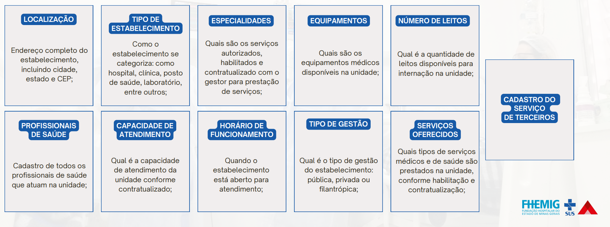

# Cadastro Nacional de Estabelecimentos de Saúde (CNES)
O **Cadastro Nacional de Estabelecimentos de Saúde (CNES)** é o sistema de informação oficial de cadastramento de informações de todos os estabelecimentos de saúde no país, no tocante à realidade da capacidade instalada e mão-de-obra assistencial, independentemente de sua natureza jurídica (públicos ou privados) ou de integrarem o SUS.

Ele é fundamental para que o serviço de saúde realize o faturamento no Sistema Único de Saúde (**SUS**). 

O CNES registra e categoriza os estabelecimentos e profissionais, garantindo a conformidade com as exigências do Ministério da Saúde para o recebimento de repasses e pagamento de procedimentos.

!!! info "Dica Importante"
    O CNES deve ser atualizado regularmente para evitar bloqueios no faturamento.

### Principais requisitos e etapas para o cadastro no CNES com fins de faturamento:
- Identificação do estabelecimento, com informações detalhadas sobre sua localização e estrutura.
- Registro dos profissionais de saúde e sua respectiva classificação de atuação.
- Adequação dos serviços oferecidos às normas estabelecidas pelo Ministério da Saúde.
- Atualização constante das informações no sistema para garantir a validade do cadastro.

<figure markdown>
  { width="800" }
  <figcaption>Informações disponíveis no CNES.</figcaption>
</figure>

### Cadastro do estabelecimento
Cada estabelecimento de saúde, como hospitais, clínicas e laboratórios, deve estar registrado no **CNES** com dados completos, incluindo:

- **CNPJ**, endereço e natureza jurídica.
- **Estrutura física**, equipamentos e leitos.

A classificação do estabelecimento inclui especificações como:

- **Tipo de unidade** (ex: hospital geral, clínica especializada).
- **Tipo de atendimento oferecido** (ambulatorial, internação, UTI, etc.).

!!! warning "Atualização do CNES"
    O **gestor local** (municipal ou estadual) é responsável por aprovar o cadastro e as atualizações de informações, conforme exigências de habilitação do **SUS**.

---

### Cadastro dos profissionais de saúde
Cada profissional de saúde precisa ter um registro atualizado no **CNES**, incluindo:

- **CPF**.
- **Número do Conselho de Classe** (CRM, CRO, etc.).
- **Especialização**.

---
### Classificação Brasileira de Ocupações (CBO)
O **CBO** é essencial para definir o papel de cada profissional no estabelecimento. A correspondência entre o **CBO** e os procedimentos que podem ser faturados é verificada automaticamente no sistema.

!!! warning "Obrigatório o cadastro de profissionais adequados"

    Profissionais com especializações específicas são necessários para a autorização de procedimentos de **alta complexidade**.

---

### Cadastro de serviços e habilitações
Para que o estabelecimento possa realizar certos procedimentos de **alta complexidade** ou especializados, ele deve ser **habilitado no CNES**. Exemplos de serviços que exigem habilitação:

- Terapia Intensiva (**UTI**).
- Terapia Nutricional.
- Oncologia.
- Serviços de Hemodiálise.

Cada **habilitação** permite o faturamento de **procedimentos específicos**. O não cumprimento das especificações pode resultar em **rejeição ou glosa**.

---

### Cadastro de leitos
Os leitos devem ser **identificados por tipo**, conforme as diretrizes estabelecidas pelo **Ministério da Saúde**. Exemplos:

- **Enfermaria**.
- **UTI** (Unidade de Terapia Intensiva).
- **UCI Neonatal** (Unidade de Cuidados Intermediários).

A correta categorização desses leitos garante que os pacientes sejam **alocados adequadamente**, conforme suas **necessidades clínicas** e o tipo de atendimento que precisam.

---

### Cadastro de equipamentos e estrutura
Equipamentos de **uso crítico**, como **tomógrafos** e **ultrassonógrafos**, devem estar registrados no **CNES**, especificando:
- **Capacidade**.
- **Compatibilidade com o SUS**.

O uso de **materiais e equipamentos** vinculados a códigos específicos (como **órteses e próteses**) também deve ser compatível com a **Tabela SIGTAP** para fins de faturamento.

---
